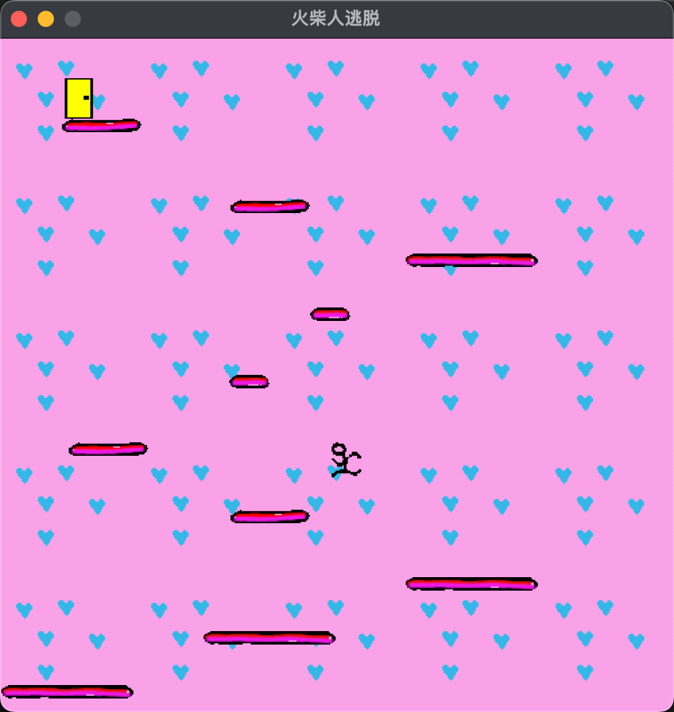

# 火柴人小游戏



## 运行

```sh
$ python3 --version         
Python 3.11.7

$ python3 ./stickman.py
```

## 参考

- [趣学Python (豆瓣)](https://book.douban.com/subject/26604879/)
- [tkinter —— Tcl/Tk 的 Python 接口](https://docs.python.org/zh-cn/3/library/tkinter.html#module-tkinter)
